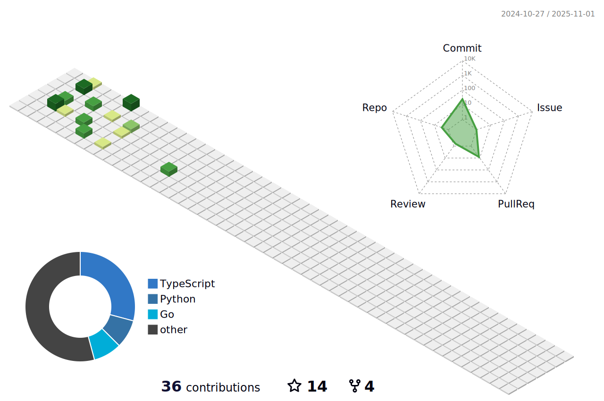

<h2 align="left">Hey👋! I'm Yobol~</h2>

###

  
  
  

###

  

    
    
    
    
    
    
    
    
    
    
  

  

    
    
    
    
    
    
    
    
    
    
    
  

  

    
    
    
    
    
    
    
  

  

    
    
    
    
    
  

  

    
  

  

    
    
    
    
    
  

  

    
    
    
    
    
    
    
  

###

  

###

 

###

